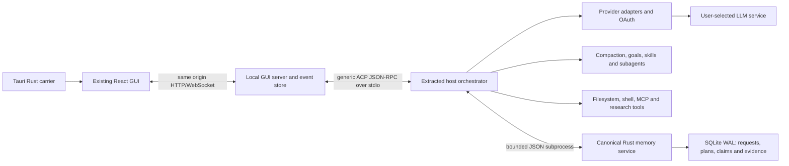

# BrainHarness runtime

The design separates the UI event store from the model execution loop and durable memory. This reuses the existing GUI's project, review, terminal and provider handling while keeping the extracted host loop replaceable through ACP.

The GUI server commits orchestration events/projections and checkpoints. The host loop owns model streaming and tool scheduling. Its Cordis composition contains host services only; the old GUI/client, hosted accounts, telemetry, upload, feedback and DeepSeek-native provider services are absent. Internal package scopes retain upstream provenance.

The existing generic ACP adapter uses advertised capabilities for session new/resume, auth, configuration, prompts, approvals and tool updates. BrainHarness is a normal local ACP provider configuration; the server adapter does not branch on its agent ID. Provider-specific connection fields are a GUI presentation aid. Terminal auth args route to the engine's generic authorization service. OAuth provider authentication is independent of application login/signup.

Rust memory uses the original ACP session ID and canonical workspace. The adapter captures human requests and actual tool results; Rust resolves durable call IDs and stores evidence/indexes transactionally. Before each model request, queued writes are drained and bounded recall is added to prompt contexts. Retrieved notes cannot replace user authority. Compaction operates on model history while the Rust journal remains available. Restart resumes the same session; changing a source marks remembered file provenance stale.

Usage travels from provider-reported counters through ACP `usage_update` metadata, validated server contracts and live provider-turn projections to the composer. Engine input buckets are disjoint; inclusive input equals uncached + cache-read + cache-write. Cache percentage is cache-read / inclusive input. Output includes reasoning when the provider reports it that way. Totals aggregate reported main-agent calls; any unavailable counter stays unknown. First-token latency measures the first request in a turn; streaming duration sums token-stream intervals, and elapsed time includes tools. Engine context pressure is the local token-meter estimate, not a provider billing counter. Zero cache values omitted by the underlying SDK stay unavailable in the cache breakdown. All-zero initialized SDK usage is withheld rather than presented as a billing report. No per-chunk token estimation or invented price is used.

Computer use is a tool provider, not hidden UI automation. Existing Playwright MCP and Cua Driver providers are opt-in and use the same tool/approval loop. Native platform prerequisites and interactive behaviour require testing on the target environment. Research retrieval and memory results are untrusted source material; no benchmark result establishes superiority over other coding harnesses.

The architecture follows the upstream separation already present in [T3 Code](https://github.com/pingdotgg/t3code) and the composable host packages in [DeepSeek Harness](https://github.com/deepseek-ai/deepseek-harness). ACP capability negotiation and session setup follow the [official initialization protocol](https://agentclientprotocol.com/protocol/v1/initialization). The native window uses [Tauri webview windows](https://v2.tauri.app/reference/javascript/api/namespacewebviewwindow/); OpenAI's retained native adapter follows the [Codex app-server interface](https://developers.openai.com/codex/app-server).
